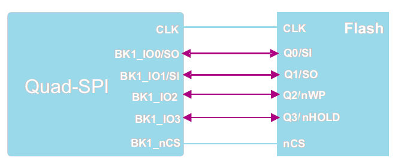

# QuadSPI (QSPI)

## QSPI class hierarchy

QSPI class hierarchy

The QSPI driver in Mbed OS provides functionality to configure and access QSPI devices connected over a QuadSPI interface.

The QSPI protocol provides a serial communication interface on four data lines between the host and the device. It uses up to six lines in total: one line for chip select, one line for clock and four lines for data in/out. You can use this interface for communication with QSPI devices, such as Flash memory, display devices and other types of devices providing QuadSPI communication support. You can also configure the QSPI interface to work in Single-SPI (traditional SPI) mode or Dual-SPI mode.

The default configuration for the QSPI interface is 1 MHz, Single-SPI, Mode 0.

The above diagram shows an example hardware configuration of a Flash memory connected over a QSPI interface.

For more information, please review the related content.

## QuadSPI class reference

## QuadSPI example

 

## Related content

- [QSPI flash block device](https://github.com/ARMmbed/qspif-blockdevice).
- [STMicroelectronics Quad-SPI documentation](https://www.st.com/content/ccc/resource/technical/document/application_note/group0/b0/7e/46/a8/5e/c1/48/01/DM00227538/files/DM00227538.pdf/jcr:content/translations/en.DM00227538.pdf).
- [Macronix MX25R6435F flash memory with Quad-SPI](http://www.macronix.com/Lists/Datasheet/Attachments/6270/MX25R6435F,%20Wide%20Range,%2064Mb,%20v1.4.pdf).
- [Nordic Quad-SPI support in NRF52840](http://infocenter.nordicsemi.com/pdf/nRF52840_OPS_v0.5.pdf).
