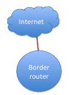
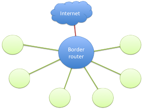
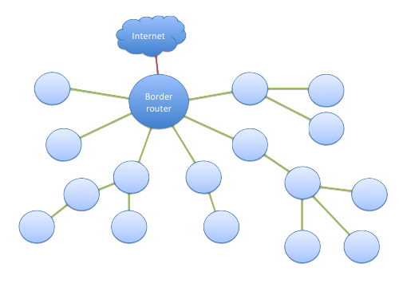

<h1 id="6LoWPAN-ND-tech">6LoWPAN-ND</h1>

6LoWPAN-ND (IPv6 over Low-Power Wireless Personal Area Networks with Neighbor Discovery) is a mesh protocol that loosely follows the [Zigbee-IP](https://www.zigbee.org/) specification. 6LoWPAN-ND allows IP-based networking to all nodes in the network.

6LoWPAN-ND protocol stack is able to operate on a license-exempt RF band, and you can configure it to use frequency hopping to lower interference. Therefore, it is applicable for multiple use cases.

## 6LoWPAN-ND API

Mbed OS provides the [Mesh C++ API](../apis/mesh-api.html) for building 6LoWPAN-ND based applications:

- To connect to the 6LoWPAN-ND network, use the [6LoWPAN-ND interface API](https://github.com/ARMmbed/mbed-os/blob/master/features/nanostack/mbed-mesh-api/mbed-mesh-api/LoWPANNDInterface.h).
- For the socket communication over the Wi-SUN network, use the [Socket API](../apis/socket.html).

### Nanostack 6LoWPAN-ND API

The Nanostack library, which provides a set of C API headers with more functionalities, implements 6LoWPAN-ND. The [nanostack folder](https://github.com/ARMmbed/mbed-os/tree/master/features/nanostack/sal-stack-nanostack/nanostack) has the `net_interface.h` header file that you can used with 6LoWPAN-ND tor initialize, start and stop a 6LoWPAN-ND interface.

## 6LoWPAN-ND network device types and network topologies

Typically, the 6LoWPAN-ND network consists of one border router on multiple low-powered nodes. You can connect the nodes to a cloud service for feeding in the sensor or control data.

### Different device types in a 6LoWPAN-ND network

In a 6LoWPAN-ND network, devices can have different roles. The colors in the illustrations represent different device types and are used in the examples throughout this section.

#### Border router (6LBR)

A border router is the coordinator of the 6LoWPAN-ND network. It handles the translations between the 6LoWPAN-ND and IPv6 networks. Arm does not provide translation to a IPv4 network due to the limited address space. We recommend using IPv6 tunnels over an IPv4 network when operating in such an environment.

The border router also authenticates the nodes joining the network and keeps track of the routing topology.

#### 6LoWPAN-ND router (6LR)

A 6LoWPAN-ND router is a node that can route packets. This role is required to form a topological or mesh network. This configuration does not allow nodes to sleep because they route packets to their siblings.

#### 6LoWPAN-ND host (6LH)

A 6LoWPAN-ND host is a type of node that does not route any packets. It has only one parent routing the packets.

#### 6LoWPAN-ND sleepy host

A 6LoWPAN-ND sleepy host is a 6LoWPAN-ND host that is periodically allowed to sleep and turn off its radio.

### Different types of mesh networks

6LoWPAN-ND-based mesh networks cannot be described as a uniform standardized network type like Wi-Fi. Depending on the business requirements and use cases, the network may have different setups and requirements.

#### Star network

Star topology is the simplest form of a mesh network. Actually, it is not mesh at all. Every node connects directly to the border router.

In a star network, nodes can be low-power devices with little RAM because they have no routing responsibilities. This topology also allows sleeping nodes.

#### Mesh, or tree, network

In a mesh, or tree, network, all nodes are configured as 6LoWPAN-ND routers.

In a 6LoWPAN-ND network, RPL protocol is used for forming the routing topology. Every node selects a primary parent for routing, so the result looks like a tree.

This network type can cover large areas because each node extends the range of the network. However, the packet is retransmitted on every hop, which means the transfer capacity of the network decreases as the size of the network increases.
