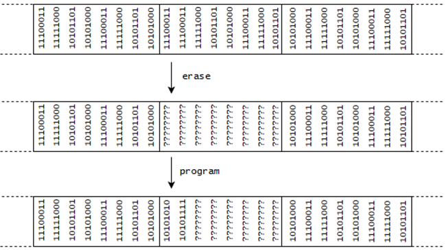

# BlockDevice

BlockDevice class hierarchy

The BlockDevice API provides an interface for access to block-based storage. You can use a block device to back a full [file system](../porting/porting-storage.html#contributing-filesystem) or write to it directly.

The most common types of block-based storage are different forms of flash, but the BlockDevice API can support many different forms of storage, such as SD cards, spinning disks and heap backed storage.

## Block device operations

A block device can perform three operations:

- Read a region of data from storage.
- Erase a region of data in storage.
- Program a region of data that has previously been erased.

A full write to a block device involves first erasing the region of memory you plan to program and then programming the data to the region of memory. The reason for this separation is that block devices can have different limitations for erasing and writing to regions on the device.

## Block device blocks

Block devices are byte addressable but operate in units of "blocks". There are three types of blocks for the three types of block device operations: read blocks, erase blocks and program blocks.

**Note:** For many devices, erase blocks can be large (for example, 4 KiB for SPI flash). As a result, we discourage storing an entire erase block in RAM. Instead, we suggest first erasing a block and then programming in units of the program block.

## Erased blocks

The state of an erased block is **undefined**. The data stored on the block isn't decided until you program the block. This allows the widest range of support for different types of storage.

## BlockDevice get default instance

The Mbed OS configuration allows you to add block devices as components using the `targets.json` file or target overrides in the application configuration file.

For details regarding how to configure the default block device please refer to the [storage configuration guide](../apis/data-storage.html)

## BlockDevice class reference

## BlockDevice example

## Related content

- [BlockDevice configuration documentation](../apis/data-options-and-config.html).
