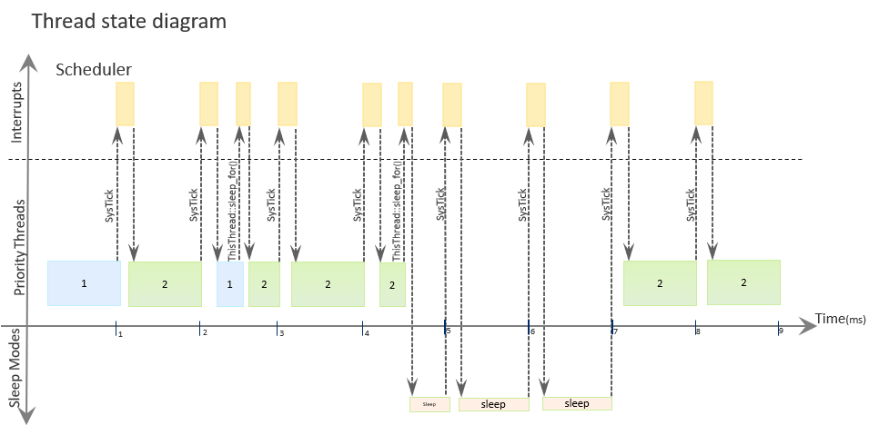

# Tickless mode

Tickless mode is an optimization mechanism available in RTOS for suspending the SysTick. You can use it in situations when RTOS is idle for multiple ticks, so you can achieve power savings by entering uninterrupted sleep. 

## Reminder on scheduling & sleep modes in Mbed OS

Mbed OS uses the SysTick timer at period of 1ms to process threads' scheduling.
For instance, a system running two threads would see its timing diagram look like :

Note how the device never enters deepsleep and wastes cycles in Systick while all thread are asleep.

## Tickless mode

To support tickless mode in Mbed OS, your target needs to meet two requirements:

- Support for Sleep HAL API
- Support for either Low Power or Microsecond Ticker HAL API

To enable tickless mode support in Mbed OS, you need to add the `MBED_TICKLESS` macro in the macros option of the target's section in the `targets.json` file.

When the tickless mode is enabled, the device default SysTick mechanism overrides by the [OsTimer](../mbed-os-api-doxy/structos__timer__def.html) implementation based on either the [low power ticker](../mbed-os-api-doxy/group__hal__lp__ticker.html) or [microsecond ticker](../mbed-os-api-doxy/group__hal__us__ticker.html).

By default, tickless mode uses the low-power ticker if available. If a target's low-power ticker has an excessively long wake-up time or other performance issues, you must set `tickless-from-us-ticker` to `true` in the target's section in the `targets.json` file to make it use the microsecond ticker instead.

If tickless mode uses the microsecond ticker, the device will only enter sleep rather than deep sleep, but will still avoid unnecessary tick calls.

The expected scheduling for the same use-case as previously described should look like :

## Testing

There are no dedicated tests validating tickless mode. Running all Mbed OS tests suites, with particular focus on HAL sleep and HAL low power ticker tests, provides sufficient coverage.

## References

You can find more details on sleep modes in mbed in the section : [Mbed OS power management sleep](../../../apis/power-management-sleep.html)
