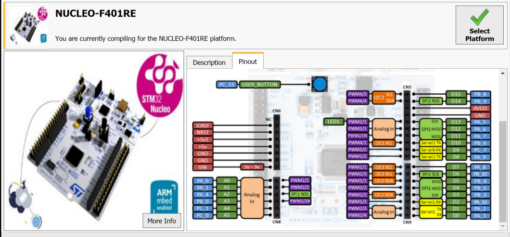

<h1 id="serial-comm">Board to PC communication over USB</h1>

The Arm Mbed microcontroller on your board can communicate with a host PC over the same USB cable that you use for programming.

If you're working on Windows earlier than Windows 10, you might need to [install a serial driver](windows-serial-driver.html).

This allows you to:

- Print out messages to a [host PC terminal (useful for debugging)](#terminal-applications).
- Read input from the host PC keyboard.
- Communicate with applications and programming languages running on the host PC that can communicate with a serial port. Examples are Perl, Python and Java.

## Hello, world

This program prints a "Hello World" message that you can view on a [terminal application](#using-terminal-applications). Communication over the USB serial port uses the standard serial interface. Specify the internal (USBTX, USBRX) pins to connect to the serial port routed over USB:

## Using terminal applications

Terminal applications run on your host PC. They provide a window where your Mbed board can print and where you can type characters back to your board.

**Serial configuration:** The standard setup for the USB serial port is 9600 baud, 8 bits, 1 stop bit, no parity (9600-8-N-1)

### Installing an application for Windows

There are many terminal applications for Windows, including:

- [CoolTerm](http://freeware.the-meiers.org/) - this is the application we use in this example. We use it often because it usually "just works".
- [Tera Term](http://sourceforge.jp/projects/ttssh2/files).
- [PuTTY](http://www.chiark.greenend.org.uk/~sgtatham/putty/).
- Some Windows PCs come with **Hyperterminal** installed.

### Configuring the connection

1. Plug in your Mbed board.
1. Open CoolTerm.
1. Click **Connect**. This opens up an 8-n-1 9600 baud connection to the first available serial port. If you have more than one board plugged in, you may need to change the port under **Options > Serial Port > Port**.

Check your connection parameters:

1. Select **Options > Serial Port**.
1. You should see 9600 baud, 8 bits, 1 stop bit, no parity (9600-8-N-1).
1. If you do not see your board, click **Re-Scan Peripherals**.

Your terminal program is now configured and connected.

## Using terminal applications on Linux

CoolTerm should work under Linux. If for some reason it doesn't, you can try one of the following:

- [Minicom](https://help.ubuntu.com/community/Minicom).
- [GNU Screen](https://www.gnu.org/software/screen/manual/screen.html).

## Minimal Printf

For low memory devices you may optionally use the [ArmMbed minimal printf library](https://github.com/ARMmbed/minimal-printf).

# Additional examples

Use your terminal application to interact with the following examples.

If you're not sure how to build these examples and run them on your board, please see our [build tools section](../tools/index.html).

## Echo back characters you type

## Use the U and D keys to make LED1 brighter or dimmer

**Note:** This example only works if LED1 is on the Pwm pin of the board you are using, such as the NUCLEO-F401RE. 

The pin map of the NUCLEO-F401RE shows LED1 on the Pwm pin.

## Pass characters in both directions

Tie pins together to see characters echoed back.

## Using stdin, stdout and stderr

By default, the C `stdin`, `stdout` and `stderr file` handles map to the PC serial connection:

## Read to a buffer

