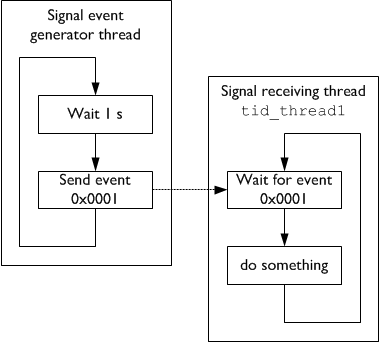

#### EvenFlags

The EventFlags class is a C++ wrapper over the Keil RTX EventFlags functionality. For more informations and
implementation details check [the Keil CMSIS-RTOS documentation.](http://arm-software.github.io/CMSIS_5/RTOS2/html/group__CMSIS__RTOS__EventFlags.html)

The mbed OS EventFlags wrapper source code can be found in the [mbed OS repository](https://github.com/ARMmbed/mbed-os/blob/master/rtos/EventFlags.h)
and the Doxygen can be found in [here](https://docs.mbed.com/docs/mbed-os-api/en/latest/api/group__rtos.html).

##### Overview

The EventFlags class provides a mechanism for setting and waiting for flags. It provides a generic way of
notifying other threads about conditions or events. Each instance of EventFlags class can be thought of as an event
channel. There is 31 different flags available for each event.

#### Example

Below is a simple example of EventFlags usage, where one thread is generating events every 1s and the second thread is
waiting for the events and executing some action.

<span class="images"></span>


```
#include "mbed.h"

EventFlags event;

void worker_f()
{
    while (true) {
        event.wait_all(0x1);

        printf("Got signal!\r\n");
    }
}

int main()
{
    Thread worker;

    worker.start(callback(worker_f));

    while (true) {
        wait(1);
        event.set(0x1);
    }
}
```
