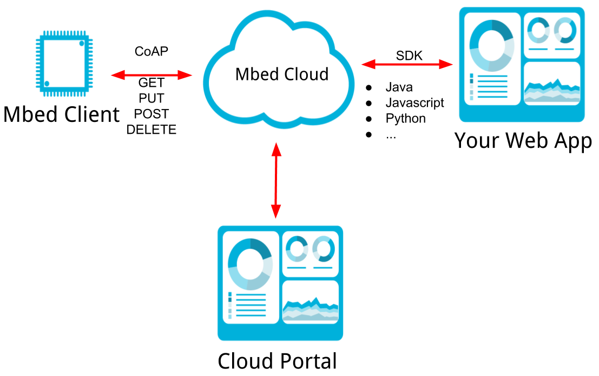

## Connecting to Mbed Cloud



The quickest way to get started with mbed cloud is to run the [Cloud Quickstart ](https://cloud.mbed.com/quick-start), this will walk you through how to get data from the embedded device to the cloud and view it in the cloud portal. Specifically it will show you how to: 
1. Import application
1. Create Cloud API Key
1. Create Certificate for Application
1. Compile and run device
1. View Resources exposed by Connector in Cloud Portal 

Mbed Cloud has 3 services. Connect is the data layer, while Update and Provisioning are for device management. 
1. Connect - This is for transferring data between device and cloud in a standardized way using LWM2M Resources. On top of these resources is CoAP, which allows the Connect service to GET, PUT and POST values to and from the resources defined by LWM2M. 
1. Update - This is for updating firmware remotely on the device in the field. The Update service is at the core of IoT, it enables devices to be fixed when new problems are discovered months or years after deployment. 
1. Provisioning - This service is specifically tailored for the unique requirements of creating devices in factories. It enables devices to be created with unique identities and then bootstrapped to customer accounts months or years later, allowing for seamless permission transitions. 

### LWM2M

LWM2M is a standard from the Open Mobile Aliance, the same people who make the cellphone standards. They have decades of experience in managing devices that must be interoperable with different companies. They brought this experience to designing LWM2M, which at its core is designed to be understood by machines with a well defined specification so if Company A goes under and Company B decided to take over management of the devices they can. 

LWM2M is based on a URL topology of `ObjectID\ObjectInstance\ResourceID\ResourceInstance`. The ObjectID and ResourceID are well defined in a giant list on the [LWM2M registry](http://www.openmobilealliance.org/wp/OMNA/LwM2M/LwM2MRegistry.html). The ObjectInstance and ResourceInstance are index's that start at 0, each time another resource or object is added then the instance is incrimented. It is very common for the ResourceInstance to be an implicit `0` and only shown when it is greater than 0 to make things simpler. 

For example, from the registry, the temperature sensor object has number `3303` and the minimum value resource has the number `5601`, the sensor value resource has the number `5700`. So in order to read the temperature sensor value from a device you should request the value of `deviceID/3303/0/5700`, which would return the value of the sensor. If there are two temperature sensors on the device then you would have two resourceID's, one with `3303/0/5700` and the other with `3303/1/5700`. 

### CoAP
CoAP is a protocol that we use in the Mbed Cloud architecture because it takes the best parts of the popular protocols of the last 30 years and pulls them together into a protocol with the following features:
- Pub/Sub just like MQTT
- Binary Encoded - size is time is money is speed. Binary encoding doesnt make the protocol readable, in fact its not meant to be read by humans, but instead by machines. What it does offer is a smaller packet size (smallest unit is 1 bit) when compared to equivalent protocols like MQTT and HTTP which all use ASCII encoding (smallest unit of value is 8 bits). This space savings makes equivalent transmissions smaller, which results in less power and less cost in data rates for equivalent data. 
- UDP or TCP - the ability to run on both UDP and TCP gives CoAP incredibly flexibility when used in challenging network environments around the world. 
- Compatible with Mbed TLS - this ensures security in transit 

### Cloud Client

Cloud Client uses LWM2M to represent values and CoAP to transmit the data. This combination provides great flexibility while still conforming to a global specification. 

The code snippet below demonstrates the configuration options available on any given resource. 

```C
	// Create Resource
	MbedCloudClientResource *button_res;

	// Configure Resource
    button_res = client.create_resource("3200/0/5501", "button_count"); // set object/resource information
    button_res->set_value(0);				// Change the value when read
    button_res->methods(M2MMethod::GET);	// GET to read, PUT/POST to write
    button_res->observable(true); 			// viewable from the cloud
    button_res->attach_notification_callback(button_callback);
```

Each resource can have 3 different methods, GET, PUT, and POST. 
- GET, this allows the cloud to read or 'get' the value off the device
- PUT, this allows the cloud to set the value or 'put' the value to the device
```C
	/**
	 * PUT handler
	 * @param resource The resource that triggered the callback
	 * @param newValue Updated value for the resource
	 */
	void callbackFN(MbedCloudClientResource *resource, m2m::String newValue) {...}

	res->methods(M2MMethod::GET | M2MMethod::PUT);
    res->attach_put_callback(callbackFN);
```
- POST, this also allows the cloud to send data to the device, this time via the 'POST' method. Unlike the PUT method, POST allows you to send an arbitrary buffer that a callback function will need to process. This allows for more flexibility than just setting a value. 
```C
	/**
	 * POST handler
	 * @param resource The resource that triggered the callback
	 * @param buffer If a body was passed to the POST function, this contains the data.
	 *               Note that the buffer is deallocated after leaving this function, so copy it if you need it longer.
	 * @param size Size of the body
	 */
	void callback_fn(MbedCloudClientResource *resource, const uint8_t *buffer, uint16_t size) {...}

	res->methods(M2MMethod::POST);
    res->attach_post_callback(callback_fn);
```


